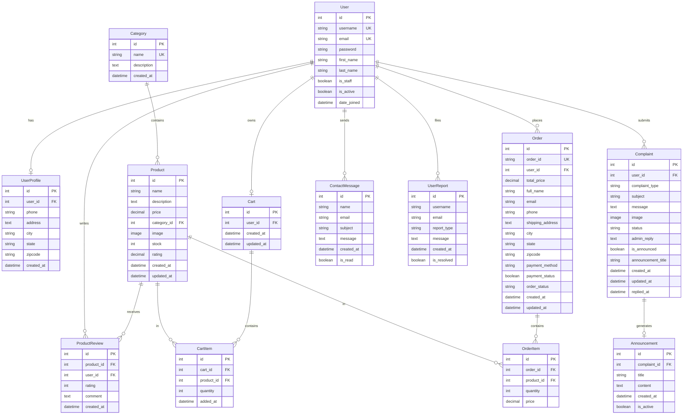

# Design Document: Complete Professional E-Commerce Store

## Overview

The Complete Professional E-Commerce Store is a full-stack web application built with Django 6.0.5 and Python 3.14, providing comprehensive online shopping functionality. The system implements a traditional three-tier architecture with presentation, business logic, and data persistence layers, delivering a secure, scalable, and user-friendly e-commerce platform.

### System Purpose

The system enables customers to browse products, manage shopping carts, place orders, and track purchases while providing administrators with tools to manage inventory, process orders, and handle customer support through an integrated complaint system.

### Key Capabilities

- **User Management**: Registration, authentication, profile management, password reset
- **Product Catalog**: Category-based browsing, search, filtering, reviews, ratings
- **Shopping Experience**: Cart management, checkout, multiple payment methods
- **Order Processing**: Order placement, tracking, history, status updates
- **Customer Support**: Complaint system with image uploads, admin replies, public announcements
- **Administration**: Product CRUD, order management, complaint handling, user management

### Technology Stack

- **Backend Framework**: Django 6.0.5 (Python 3.14)
- **Database**: SQLite (development), PostgreSQL/MySQL (production-ready)
- **Frontend**: HTML5, CSS3, JavaScript ES6+, Bootstrap 5.3
- **Image Processing**: Pillow
- **Icons**: Font Awesome 6.4
- **Session Management**: Django sessions with 24-hour expiration
- **Email**: Console backend (development), SMTP (production)

## Architecture

### System Architecture Pattern

The application follows Django's MTV (Model-Template-View) architecture, which is a variant of MVC:

```
┌─────────────────────────────────────────────────────────────┐
│                        Client Layer                          │
│  (Browser: HTML5, CSS3, JavaScript, Bootstrap 5)            │
└────────────────────┬────────────────────────────────────────┘
                     │ HTTP/HTTPS
                     ↓
┌─────────────────────────────────────────────────────────────┐
│                    Presentation Layer                        │
│                  (Django Templates + Views)                  │
│  ┌──────────┬──────────┬──────────┬──────────┬──────────┐  │
│  │ Products │  Users   │   Cart   │  Orders  │ Complaints│  │
│  │Templates │Templates │Templates │Templates │ Templates │  │
│  └──────────┴──────────┴──────────┴──────────┴──────────┘  │
└────────────────────┬────────────────────────────────────────┘
                     │
                     ↓
┌─────────────────────────────────────────────────────────────┐
│                   Business Logic Layer                       │
│                    (Django Views + Forms)                    │
│  ┌──────────┬──────────┬──────────┬──────────┬──────────┐  │
│  │ Product  │   User   │   Cart   │  Order   │Complaint │  │
│  │  Views   │  Views   │  Views   │  Views   │  Views   │  │
│  └──────────┴──────────┴──────────┴──────────┴──────────┘  │
│  ┌──────────────────────────────────────────────────────┐  │
│  │        Authentication & Authorization Middleware      │  │
│  │        CSRF Protection, Session Management            │  │
│  └──────────────────────────────────────────────────────┘  │
└────────────────────┬────────────────────────────────────────┘
                     │
                     ↓
┌─────────────────────────────────────────────────────────────┐
│                   Data Access Layer                          │
│                    (Django ORM + Models)                     │
│  ┌──────────┬──────────┬──────────┬──────────┬──────────┐  │
│  │ Product  │   User   │   Cart   │  Order   │Complaint │  │
│  │  Models  │  Models  │  Models  │  Models  │  Models  │  │
│  └──────────┴──────────┴──────────┴──────────┴──────────┘  │
└────────────────────┬────────────────────────────────────────┘
                     │
                     ↓
┌─────────────────────────────────────────────────────────────┐
│                    Persistence Layer                         │
│              SQLite (Dev) / PostgreSQL (Prod)                │
└─────────────────────────────────────────────────────────────┘
```

### Application Structure

The system is organized into five Django applications, each with clear responsibilities:


1. **ecommerce** (Core Application)
   - Project configuration and settings
   - URL routing coordination
   - Middleware configuration
   - Context processors (currency, cart count)
   - WSGI/ASGI application entry points

2. **products** (Product Management)
   - Product catalog display and search
   - Category management
   - Product reviews and ratings
   - Related product recommendations
   - Stock availability tracking

3. **users** (User Management)
   - User registration and authentication
   - Profile management
   - Password reset functionality
   - User dashboard with statistics
   - Contact messages and user reports
   - Complaint system with image uploads
   - Public announcements

4. **cart** (Shopping Cart)
   - Cart and CartItem management
   - Add/update/remove operations
   - Cart persistence per user
   - Real-time cart count context processor
   - Subtotal and total calculations

5. **orders** (Order Processing)
   - Checkout process
   - Order creation with unique IDs
   - Order history and tracking
   - Order status management
   - Stock reduction on order placement

### Request Flow

```
User Request → URL Router → Middleware Stack → View Function → 
Business Logic → Model/ORM → Database → Response → Template → 
HTML Response → User Browser
```


### Middleware Stack

The application uses Django's middleware in the following order:

1. **SecurityMiddleware**: Handles security-related headers and HTTPS redirects
2. **SessionMiddleware**: Manages user sessions with 24-hour expiration
3. **CommonMiddleware**: URL normalization and APPEND_SLASH handling
4. **CsrfViewMiddleware**: CSRF token validation for all POST requests
5. **AuthenticationMiddleware**: Associates users with requests
6. **MessageMiddleware**: Temporary message storage for user feedback
7. **ClickjackingMiddleware**: X-Frame-Options header protection

## Components and Interfaces

### Core Components

#### 1. Authentication System

**Component**: `users.views` (register, login, logout, profile, dashboard)

**Responsibilities**:
- User registration with validation
- Login/logout with session management
- Profile CRUD operations
- Password hashing using PBKDF2
- Dashboard statistics calculation

**Key Interfaces**:
```python
# Registration
POST /users/register/
Input: username, email, password1, password2, first_name, last_name
Output: Redirect to login or validation errors

# Login
POST /users/login/
Input: username, password
Output: Session cookie, redirect to home

# Profile Update
POST /users/profile/
Input: phone, address, city, state, zipcode
Output: Success message, updated profile
```


#### 2. Product Catalog System

**Component**: `products.views` (home, product_list, product_detail, add_review)

**Responsibilities**:
- Product listing with pagination
- Search and category filtering
- Product detail display with reviews
- Review submission and rating calculation
- Related product recommendations
- Stock status display

**Key Interfaces**:
```python
# Product List
GET /products/?search=<term>&category=<id>
Output: Paginated product list, filtered results

# Product Detail
GET /product/<int:pk>/
Output: Product details, reviews, related products

# Add Review
POST /product/<int:pk>/review/
Input: rating (1-5), comment
Output: Created/updated review, recalculated average rating
```

#### 3. Shopping Cart System

**Component**: `cart.views` (cart_view, add_to_cart, update_cart, remove_from_cart, clear_cart)

**Responsibilities**:
- Cart creation per user
- CartItem CRUD operations
- Stock validation on add/update
- Subtotal and total calculations
- Cart persistence across sessions

**Key Interfaces**:
```python
# Add to Cart
POST /cart/add/<int:product_id>/
Input: quantity
Output: CartItem created/updated, success message

# Update Cart
POST /cart/update/<int:item_id>/
Input: quantity
Output: Updated CartItem or removed if quantity=0

# Cart View
GET /cart/
Output: All CartItems with subtotals, total price
```


#### 4. Order Processing System

**Component**: `orders.views` (checkout, place_order, order_success, order_history, order_detail)

**Responsibilities**:
- Checkout form display and validation
- Order creation with unique ID generation
- OrderItem creation from CartItems
- Stock reduction on order placement
- Cart clearing after order
- Order history and tracking

**Key Interfaces**:
```python
# Checkout
GET /orders/checkout/
Output: Checkout form with cart summary

# Place Order
POST /orders/place-order/
Input: full_name, email, phone, shipping_address, city, state, 
       zipcode, payment_method
Output: Order created, stock reduced, cart cleared, redirect to success

# Order History
GET /orders/history/
Output: All user orders with status and totals

# Order Detail
GET /orders/detail/<str:order_id>/
Output: Complete order information, items, shipping details
```

#### 5. Complaint Management System

**Component**: `users.views` (submit_complaint, my_complaints, complaint_detail, announcements)

**Responsibilities**:
- Complaint submission with optional image
- Image validation and storage
- Complaint status tracking
- Admin reply management
- Public announcement creation
- Announcement display

**Key Interfaces**:
```python
# Submit Complaint
POST /users/submit-complaint/
Input: complaint_type, subject, message, image (optional)
Output: Complaint created with pending status

# My Complaints
GET /users/my-complaints/
Output: All user complaints with status

# Announcements
GET /users/announcements/
Output: All active public announcements
```


#### 6. Password Reset System

**Component**: `users.views` (password_reset, password_reset_confirm)

**Responsibilities**:
- Token generation for password reset
- Email sending with reset link
- Token validation and expiration (24 hours)
- Password update with re-hashing
- One-time token usage enforcement

**Key Interfaces**:
```python
# Request Reset
POST /users/password-reset/
Input: email
Output: Token generated, email sent

# Confirm Reset
POST /users/password-reset-confirm/<token>/
Input: new_password1, new_password2
Output: Password updated, token invalidated
```

### Context Processors

#### Cart Count Context Processor

**Location**: `cart.context_processors.cart_count`

**Purpose**: Provides real-time cart item count to all templates

**Implementation**:
```python
def cart_count(request):
    if request.user.is_authenticated:
        cart = Cart.objects.filter(user=request.user).first()
        count = cart.total_items if cart else 0
        return {'cart_count': count}
    return {'cart_count': 0}
```

#### Currency Context Processor

**Location**: `ecommerce.context_processors.currency`

**Purpose**: Provides currency symbol and code to all templates

**Implementation**:
```python
def currency(request):
    return {
        'CURRENCY_SYMBOL': settings.CURRENCY_SYMBOL,
        'CURRENCY_CODE': settings.CURRENCY_CODE
    }
```


## Data Models

### Entity Relationship Diagram




### Model Specifications

#### User Model (Django Built-in)

**Purpose**: Core authentication and user identity

**Fields**:
- `id`: Auto-incrementing primary key
- `username`: Unique username (max 150 chars)
- `email`: Unique email address
- `password`: PBKDF2-hashed password with salt
- `first_name`: Optional first name (max 150 chars)
- `last_name`: Optional last name (max 150 chars)
- `is_staff`: Boolean for admin access
- `is_active`: Boolean for account status
- `date_joined`: Timestamp of registration

**Relationships**:
- One-to-one with UserProfile
- One-to-many with ProductReview, Cart, Order, Complaint

#### UserProfile Model

**Purpose**: Extended user information for shipping and contact

**Fields**:
- `id`: Primary key
- `user_id`: Foreign key to User (CASCADE delete)
- `phone`: Optional phone number (max 15 chars)
- `address`: Optional text address
- `city`: Optional city (max 100 chars)
- `state`: Optional state (max 100 chars)
- `zipcode`: Optional zipcode (max 10 chars)
- `created_at`: Auto-set creation timestamp

**Relationships**:
- One-to-one with User (related_name='profile')

**Constraints**:
- All fields except user_id are optional


#### Category Model

**Purpose**: Product classification and organization

**Fields**:
- `id`: Primary key
- `name`: Unique category name (max 100 chars)
- `description`: Optional text description
- `created_at`: Auto-set creation timestamp

**Relationships**:
- One-to-many with Product (related_name='products')

**Constraints**:
- Name must be unique
- Ordered alphabetically by name

#### Product Model

**Purpose**: Product catalog items with inventory

**Fields**:
- `id`: Primary key
- `name`: Product name (max 200 chars)
- `description`: Text description
- `price`: Decimal (10 digits, 2 decimal places)
- `category_id`: Foreign key to Category (CASCADE delete)
- `image`: ImageField (upload_to='products/', default='products/default.jpg')
- `stock`: Positive integer (default 0)
- `rating`: Decimal (3 digits, 2 decimal places, default 0.00)
- `created_at`: Auto-set creation timestamp
- `updated_at`: Auto-updated timestamp

**Relationships**:
- Many-to-one with Category
- One-to-many with ProductReview, CartItem, OrderItem

**Computed Properties**:
- `is_available`: Returns True if stock > 0

**Constraints**:
- Price must be positive
- Stock must be non-negative
- Rating between 0.00 and 5.00
- Ordered by creation date descending


#### ProductReview Model

**Purpose**: User ratings and comments for products

**Fields**:
- `id`: Primary key
- `product_id`: Foreign key to Product (CASCADE delete)
- `user_id`: Foreign key to User (CASCADE delete)
- `rating`: Integer choice (1-5)
- `comment`: Text comment
- `created_at`: Auto-set creation timestamp

**Relationships**:
- Many-to-one with Product (related_name='reviews')
- Many-to-one with User

**Constraints**:
- Unique together (product, user) - one review per user per product
- Rating must be between 1 and 5
- Ordered by creation date descending

#### Cart Model

**Purpose**: User shopping cart container

**Fields**:
- `id`: Primary key
- `user_id`: Foreign key to User (CASCADE delete)
- `created_at`: Auto-set creation timestamp
- `updated_at`: Auto-updated timestamp

**Relationships**:
- Many-to-one with User (related_name='cart')
- One-to-many with CartItem (related_name='items')

**Computed Properties**:
- `total_price`: Sum of all CartItem subtotals
- `total_items`: Sum of all CartItem quantities

**Constraints**:
- One cart per user (enforced at application level)


#### CartItem Model

**Purpose**: Individual products in shopping cart

**Fields**:
- `id`: Primary key
- `cart_id`: Foreign key to Cart (CASCADE delete)
- `product_id`: Foreign key to Product (CASCADE delete)
- `quantity`: Positive integer (default 1)
- `added_at`: Auto-set creation timestamp

**Relationships**:
- Many-to-one with Cart (related_name='items')
- Many-to-one with Product

**Computed Properties**:
- `subtotal`: product.price × quantity

**Constraints**:
- Unique together (cart, product) - one entry per product per cart
- Quantity must be positive

#### Order Model

**Purpose**: Completed purchase transactions

**Fields**:
- `id`: Primary key
- `order_id`: Unique string (format: "ORD-" + 8 hex chars, auto-generated)
- `user_id`: Foreign key to User (CASCADE delete)
- `total_price`: Decimal (10 digits, 2 decimal places)
- `full_name`: String (max 200 chars)
- `email`: Email field
- `phone`: String (max 15 chars)
- `shipping_address`: Text field
- `city`: String (max 100 chars)
- `state`: String (max 100 chars)
- `zipcode`: String (max 10 chars)
- `payment_method`: Choice field (cod, card, upi, netbanking)
- `payment_status`: Boolean (default False)
- `order_status`: Choice field (pending, processing, shipped, delivered, cancelled)
- `created_at`: Auto-set creation timestamp
- `updated_at`: Auto-updated timestamp

**Relationships**:
- Many-to-one with User (related_name='orders')
- One-to-many with OrderItem (related_name='items')

**Constraints**:
- order_id must be unique
- Ordered by creation date descending
- All shipping fields required


#### OrderItem Model

**Purpose**: Products within an order with snapshot pricing

**Fields**:
- `id`: Primary key
- `order_id`: Foreign key to Order (CASCADE delete)
- `product_id`: Foreign key to Product (CASCADE delete)
- `quantity`: Positive integer
- `price`: Decimal (10 digits, 2 decimal places) - snapshot at order time

**Relationships**:
- Many-to-one with Order (related_name='items')
- Many-to-one with Product

**Computed Properties**:
- `subtotal`: price × quantity

**Constraints**:
- Quantity must be positive
- Price stored at order creation time (not linked to current product price)

#### Complaint Model

**Purpose**: User issue reports with admin support

**Fields**:
- `id`: Primary key
- `user_id`: Foreign key to User (CASCADE delete)
- `complaint_type`: Choice field (product_quality, delivery_issue, customer_service, payment_issue, website_issue, other)
- `subject`: String (max 200 chars)
- `message`: Text field
- `image`: Optional ImageField (upload_to='complaints/', max 5MB)
- `status`: Choice field (pending, under_review, resolved, closed, default='pending')
- `admin_reply`: Optional text field (private)
- `is_announced`: Boolean (default False)
- `announcement_title`: Optional string (max 200 chars)
- `created_at`: Auto-set creation timestamp
- `updated_at`: Auto-updated timestamp
- `replied_at`: Optional timestamp (set when admin replies)

**Relationships**:
- Many-to-one with User (related_name='complaints')
- One-to-one with Announcement (related_name='announcement')

**Constraints**:
- Ordered by creation date descending
- Image formats: JPG, PNG, GIF only
- Image size limit: 5MB


#### Announcement Model

**Purpose**: Public notices from useful complaints

**Fields**:
- `id`: Primary key
- `complaint_id`: Foreign key to Complaint (CASCADE delete, unique)
- `title`: String (max 200 chars)
- `content`: Text field
- `created_at`: Auto-set creation timestamp
- `is_active`: Boolean (default True)

**Relationships**:
- One-to-one with Complaint (related_name='announcement')

**Constraints**:
- Ordered by creation date descending
- Only active announcements shown publicly

#### ContactMessage Model

**Purpose**: General contact form submissions

**Fields**:
- `id`: Primary key
- `name`: String (max 200 chars)
- `email`: Email field
- `subject`: String (max 200 chars)
- `message`: Text field
- `created_at`: Auto-set creation timestamp
- `is_read`: Boolean (default False)

**Constraints**:
- Ordered by creation date descending
- No authentication required

#### UserReport Model

**Purpose**: Reports from deactivated users

**Fields**:
- `id`: Primary key
- `username`: String (max 150 chars)
- `email`: Email field
- `report_type`: Choice field (account_deactivated, cannot_login, technical_issue, other)
- `message`: Text field
- `created_at`: Auto-set creation timestamp
- `is_resolved`: Boolean (default False)

**Constraints**:
- Ordered by creation date descending
- No authentication required


## API Endpoints and URL Routing

### URL Structure

```
/                                   → products:home
/products/                          → products:product_list
/product/<int:pk>/                  → products:product_detail
/product/<int:pk>/review/           → products:add_review

/users/register/                    → users:register
/users/login/                       → users:login
/users/logout/                      → users:logout
/users/profile/                     → users:profile
/users/dashboard/                   → users:dashboard
/users/password-reset/              → users:password_reset
/users/password-reset-confirm/<token>/ → users:password_reset_confirm
/users/contact/                     → users:contact
/users/about/                       → users:about
/users/report/                      → users:user_report
/users/submit-complaint/            → users:submit_complaint
/users/my-complaints/               → users:my_complaints
/users/complaint/<int:pk>/          → users:complaint_detail
/users/announcements/               → users:announcements

/cart/                              → cart:cart_view
/cart/add/<int:product_id>/         → cart:add_to_cart
/cart/update/<int:item_id>/         → cart:update_cart
/cart/remove/<int:item_id>/         → cart:remove_from_cart
/cart/clear/                        → cart:clear_cart

/orders/checkout/                   → orders:checkout
/orders/place-order/                → orders:place_order
/orders/success/<str:order_id>/     → orders:order_success
/orders/history/                    → orders:order_history
/orders/detail/<str:order_id>/      → orders:order_detail

/admin/                             → Django Admin Panel

/media/<path>                       → Static file serving (development)
/static/<path>                      → Static file serving
```


### Endpoint Specifications

#### Product Endpoints

**GET /** (Home Page)
- **Purpose**: Display featured products and marketing content
- **Authentication**: Not required
- **Query Parameters**: None
- **Response**: HTML with 8 most recent products, testimonials, statistics
- **Template**: `products/home.html`

**GET /products/** (Product List)
- **Purpose**: Display all products with search and filtering
- **Authentication**: Not required
- **Query Parameters**: 
  - `search` (optional): Search term for name/description
  - `category` (optional): Category ID filter
- **Response**: HTML with paginated product list
- **Template**: `products/product_list.html`

**GET /product/<int:pk>/** (Product Detail)
- **Purpose**: Display single product with reviews and related products
- **Authentication**: Not required
- **Path Parameters**: `pk` - Product ID
- **Response**: HTML with product details, reviews, related products (up to 4)
- **Template**: `products/product_detail.html`

**POST /product/<int:pk>/review/** (Add Review)
- **Purpose**: Submit or update product review
- **Authentication**: Required
- **Path Parameters**: `pk` - Product ID
- **Request Body**: `rating` (1-5), `comment` (text)
- **Response**: Redirect to product detail with success message
- **Validation**: Rating required, comment required, one review per user per product


#### User Endpoints

**GET /users/register/** (Registration Form)
- **Purpose**: Display user registration form
- **Authentication**: Not required (redirects if authenticated)
- **Response**: HTML registration form
- **Template**: `users/register.html`

**POST /users/register/** (Register User)
- **Purpose**: Create new user account
- **Authentication**: Not required
- **Request Body**: `username`, `email`, `password1`, `password2`, `first_name`, `last_name`
- **Response**: Redirect to login with success message
- **Validation**: Username unique, email unique, passwords match, email format

**GET /users/login/** (Login Form)
- **Purpose**: Display login form
- **Authentication**: Not required (redirects if authenticated)
- **Response**: HTML login form
- **Template**: `users/login.html`

**POST /users/login/** (Authenticate User)
- **Purpose**: Authenticate user and create session
- **Authentication**: Not required
- **Request Body**: `username`, `password`
- **Response**: Redirect to home with session cookie
- **Validation**: Credentials valid, account active

**GET /users/logout/** (Logout)
- **Purpose**: Terminate user session
- **Authentication**: Required
- **Response**: Redirect to home, session destroyed

**GET /users/profile/** (Profile Form)
- **Purpose**: Display user profile edit form
- **Authentication**: Required
- **Response**: HTML with current profile data
- **Template**: `users/profile.html`

**POST /users/profile/** (Update Profile)
- **Purpose**: Update user profile information
- **Authentication**: Required
- **Request Body**: `phone`, `address`, `city`, `state`, `zipcode`
- **Response**: Redirect to profile with success message
- **Validation**: All fields optional


**GET /users/dashboard/** (User Dashboard)
- **Purpose**: Display user statistics and recent orders
- **Authentication**: Required
- **Response**: HTML with order count, total spending, cart items, 5 recent orders
- **Template**: `users/dashboard.html`

**GET /users/password-reset/** (Password Reset Request)
- **Purpose**: Display password reset request form
- **Authentication**: Not required
- **Response**: HTML password reset form
- **Template**: `users/password_reset.html`

**POST /users/password-reset/** (Send Reset Email)
- **Purpose**: Generate token and send reset email
- **Authentication**: Not required
- **Request Body**: `email`
- **Response**: Success message, email sent with token link
- **Validation**: Email exists in system

**GET /users/password-reset-confirm/<token>/** (Reset Form)
- **Purpose**: Display password reset form with token validation
- **Authentication**: Not required
- **Path Parameters**: `token` - Reset token
- **Response**: HTML password reset form or error if token invalid/expired
- **Template**: `users/password_reset_confirm.html`

**POST /users/password-reset-confirm/<token>/** (Reset Password)
- **Purpose**: Update password with valid token
- **Authentication**: Not required
- **Path Parameters**: `token` - Reset token
- **Request Body**: `new_password1`, `new_password2`
- **Response**: Redirect to login with success message
- **Validation**: Token valid, passwords match, password strength


#### Cart Endpoints

**GET /cart/** (View Cart)
- **Purpose**: Display shopping cart contents
- **Authentication**: Required
- **Response**: HTML with all cart items, subtotals, total
- **Template**: `cart/cart.html`

**POST /cart/add/<int:product_id>/** (Add to Cart)
- **Purpose**: Add product to cart or update quantity
- **Authentication**: Required
- **Path Parameters**: `product_id` - Product ID
- **Request Body**: `quantity` (integer)
- **Response**: Redirect to cart with success message
- **Validation**: Product exists, stock available, quantity positive

**POST /cart/update/<int:item_id>/** (Update Cart Item)
- **Purpose**: Update cart item quantity or remove if zero
- **Authentication**: Required
- **Path Parameters**: `item_id` - CartItem ID
- **Request Body**: `quantity` (integer)
- **Response**: Redirect to cart with success message
- **Validation**: Item belongs to user, stock available, quantity non-negative

**GET /cart/remove/<int:item_id>/** (Remove from Cart)
- **Purpose**: Delete cart item
- **Authentication**: Required
- **Path Parameters**: `item_id` - CartItem ID
- **Response**: Redirect to cart with success message
- **Validation**: Item belongs to user

**GET /cart/clear/** (Clear Cart)
- **Purpose**: Remove all items from cart
- **Authentication**: Required
- **Response**: Redirect to cart with success message


#### Order Endpoints

**GET /orders/checkout/** (Checkout Form)
- **Purpose**: Display checkout form with cart summary
- **Authentication**: Required
- **Response**: HTML checkout form or redirect if cart empty
- **Template**: `orders/checkout.html`
- **Validation**: Cart must have items

**POST /orders/place-order/** (Create Order)
- **Purpose**: Create order, reduce stock, clear cart
- **Authentication**: Required
- **Request Body**: `full_name`, `email`, `phone`, `shipping_address`, `city`, `state`, `zipcode`, `payment_method`
- **Response**: Redirect to order success page
- **Side Effects**:
  - Create Order with unique order_id
  - Create OrderItems from CartItems
  - Reduce Product stock by ordered quantities
  - Clear user's Cart
- **Validation**: All fields required, email format, cart not empty, stock available

**GET /orders/success/<str:order_id>/** (Order Confirmation)
- **Purpose**: Display order confirmation
- **Authentication**: Required
- **Path Parameters**: `order_id` - Order ID
- **Response**: HTML with order confirmation details
- **Template**: `orders/order_success.html`
- **Validation**: Order belongs to user

**GET /orders/history/** (Order History)
- **Purpose**: Display all user orders
- **Authentication**: Required
- **Response**: HTML with all orders, status, totals
- **Template**: `orders/order_history.html`

**GET /orders/detail/<str:order_id>/** (Order Detail)
- **Purpose**: Display complete order information
- **Authentication**: Required
- **Path Parameters**: `order_id` - Order ID
- **Response**: HTML with order items, shipping, payment details
- **Template**: `orders/order_detail.html`
- **Validation**: Order belongs to user


#### Complaint and Support Endpoints

**GET /users/submit-complaint/** (Complaint Form)
- **Purpose**: Display complaint submission form
- **Authentication**: Required
- **Response**: HTML complaint form
- **Template**: `users/submit_complaint.html`

**POST /users/submit-complaint/** (Submit Complaint)
- **Purpose**: Create new complaint with optional image
- **Authentication**: Required
- **Request Body**: `complaint_type`, `subject`, `message`, `image` (optional file)
- **Response**: Redirect to my complaints with success message
- **Validation**: Image format (JPG/PNG/GIF), image size (max 5MB)

**GET /users/my-complaints/** (User Complaints)
- **Purpose**: Display all user's complaints
- **Authentication**: Required
- **Response**: HTML with all complaints, status, dates
- **Template**: `users/my_complaints.html`

**GET /users/complaint/<int:pk>/** (Complaint Detail)
- **Purpose**: Display complaint details and admin reply
- **Authentication**: Required
- **Path Parameters**: `pk` - Complaint ID
- **Response**: HTML with complaint info, image, admin reply
- **Template**: `users/complaint_detail.html`
- **Validation**: Complaint belongs to user

**GET /users/announcements/** (Public Announcements)
- **Purpose**: Display all active public announcements
- **Authentication**: Not required
- **Response**: HTML with announcements from useful complaints
- **Template**: `users/announcements.html`

**GET /users/contact/** (Contact Form)
- **Purpose**: Display contact form with FAQ
- **Authentication**: Not required
- **Response**: HTML contact form
- **Template**: `users/contact.html`

**POST /users/contact/** (Submit Contact Message)
- **Purpose**: Create contact message
- **Authentication**: Not required
- **Request Body**: `name`, `email`, `subject`, `message`
- **Response**: Redirect with success message
- **Validation**: Email format


**GET /users/about/** (About Page)
- **Purpose**: Display company information
- **Authentication**: Not required
- **Response**: HTML with mission, values, team
- **Template**: `users/about.html`

**GET /users/report/** (User Report Form)
- **Purpose**: Display report form for deactivated users
- **Authentication**: Not required
- **Response**: HTML report form
- **Template**: `users/user_report.html`

**POST /users/report/** (Submit User Report)
- **Purpose**: Create user report
- **Authentication**: Not required
- **Request Body**: `username`, `email`, `report_type`, `message`
- **Response**: Redirect with success message
- **Validation**: Email format

## Security Architecture

### Authentication and Authorization

#### Password Security

**Hashing Algorithm**: Django's PBKDF2 with SHA256
- **Iterations**: 390,000 (Django 6.0 default)
- **Salt**: Randomly generated per password
- **Format**: `pbkdf2_sha256$390000$<salt>$<hash>`

**Password Validation**:
- Minimum length: 8 characters
- Not similar to user attributes
- Not in common password list
- Not entirely numeric

**Implementation**:
```python
from django.contrib.auth.hashers import make_password, check_password

# Registration
hashed = make_password(plain_password)

# Login
is_valid = check_password(plain_password, hashed_password)
```


#### Session Management

**Configuration**:
- **Backend**: Database-backed sessions
- **Cookie Name**: `sessionid`
- **Cookie Age**: 86400 seconds (24 hours)
- **Save Every Request**: True (extends session on activity)
- **HTTP Only**: True (prevents JavaScript access)
- **Secure**: True in production (HTTPS only)

**Session Data**:
- User ID
- Authentication timestamp
- CSRF token
- Flash messages

**Implementation**:
```python
# Login
from django.contrib.auth import login
login(request, user)

# Logout
from django.contrib.auth import logout
logout(request)

# Check authentication
if request.user.is_authenticated:
    # User is logged in
```

#### Authorization Patterns

**View-Level Protection**:
```python
from django.contrib.auth.decorators import login_required

@login_required
def protected_view(request):
    # Only authenticated users can access
    pass
```

**Object-Level Protection**:
```python
def order_detail(request, order_id):
    order = get_object_or_404(Order, order_id=order_id)
    if order.user != request.user:
        return HttpResponseForbidden()
    # User owns this order
```

**Admin-Only Protection**:
```python
from django.contrib.admin.views.decorators import staff_member_required

@staff_member_required
def admin_view(request):
    # Only staff users can access
    pass
```


### CSRF Protection

**Mechanism**: Synchronizer token pattern

**Implementation**:
- Token generated per session
- Token embedded in forms via ``
- Token validated on POST requests
- Middleware: `CsrfViewMiddleware`

**Template Usage**:
```html
<form method="post">
    
    <!-- form fields -->
</form>
```

**AJAX Usage**:
```javascript
// Get CSRF token from cookie
function getCookie(name) {
    let cookieValue = null;
    if (document.cookie && document.cookie !== '') {
        const cookies = document.cookie.split(';');
        for (let i = 0; i < cookies.length; i++) {
            const cookie = cookies[i].trim();
            if (cookie.substring(0, name.length + 1) === (name + '=')) {
                cookieValue = decodeURIComponent(cookie.substring(name.length + 1));
                break;
            }
        }
    }
    return cookieValue;
}

// Include in AJAX requests
fetch(url, {
    method: 'POST',
    headers: {
        'X-CSRFToken': getCookie('csrftoken')
    },
    body: data
});
```

### SQL Injection Prevention

**Mechanism**: Django ORM parameterized queries

**Safe Patterns**:
```python
# ORM queries (safe)
Product.objects.filter(name__icontains=search_term)
User.objects.get(username=username)

# Raw queries with parameters (safe)
Product.objects.raw('SELECT * FROM products WHERE name = %s', [name])
```

**Unsafe Patterns (NEVER USE)**:
```python
# String interpolation (UNSAFE)
Product.objects.raw(f'SELECT * FROM products WHERE name = {name}')
```


### XSS Protection

**Mechanism**: Django template auto-escaping

**Default Behavior**:
```html
<!-- Automatically escaped -->
<p>{{ user_input }}</p>
<!-- Renders: <p>&lt;script&gt;alert('xss')&lt;/script&gt;</p> -->
```

**Safe HTML (when needed)**:
```python
from django.utils.safestring import mark_safe

# Only use with trusted, sanitized content
safe_html = mark_safe(sanitized_content)
```

**Template Filter**:
```html
<!-- Explicitly mark as safe (use cautiously) -->
{{ trusted_html|safe }}
```

### File Upload Security

**Image Validation**:
```python
from PIL import Image

def validate_image(file):
    # Check file extension
    allowed_extensions = ['.jpg', '.jpeg', '.png', '.gif']
    ext = os.path.splitext(file.name)[1].lower()
    if ext not in allowed_extensions:
        raise ValidationError('Invalid file type')
    
    # Check file size (5MB max)
    if file.size > 5 * 1024 * 1024:
        raise ValidationError('File too large')
    
    # Verify it's actually an image
    try:
        img = Image.open(file)
        img.verify()
    except:
        raise ValidationError('Invalid image file')
```

**Storage Configuration**:
```python
# settings.py
MEDIA_ROOT = BASE_DIR / 'media'
MEDIA_URL = '/media/'

# Separate directories for different upload types
# products/ - Product images
# complaints/ - Complaint images
```


### Input Validation

**Form Validation**:
```python
from django import forms

class CheckoutForm(forms.Form):
    full_name = forms.CharField(max_length=200, required=True)
    email = forms.EmailField(required=True)
    phone = forms.CharField(max_length=15, required=True)
    # ... other fields
    
    def clean_email(self):
        email = self.cleaned_data['email']
        # Additional validation
        return email
    
    def clean(self):
        cleaned_data = super().clean()
        # Cross-field validation
        return cleaned_data
```

**Model Validation**:
```python
from django.core.validators import MinValueValidator, MaxValueValidator

class Product(models.Model):
    price = models.DecimalField(
        max_digits=10,
        decimal_places=2,
        validators=[MinValueValidator(0.01)]
    )
    stock = models.PositiveIntegerField(
        validators=[MinValueValidator(0)]
    )
```

### Clickjacking Protection

**Mechanism**: X-Frame-Options header

**Configuration**:
```python
# settings.py
X_FRAME_OPTIONS = 'DENY'  # Prevents framing entirely
# or
X_FRAME_OPTIONS = 'SAMEORIGIN'  # Allows same-origin framing
```

**Middleware**: `XFrameOptionsMiddleware`


### Production Security Checklist

**settings.py Configuration**:
```python
# Production settings
DEBUG = False
SECRET_KEY = os.environ.get('SECRET_KEY')  # From environment variable
ALLOWED_HOSTS = ['yourdomain.com', 'www.yourdomain.com']

# HTTPS settings
SECURE_SSL_REDIRECT = True
SESSION_COOKIE_SECURE = True
CSRF_COOKIE_SECURE = True
SECURE_BROWSER_XSS_FILTER = True
SECURE_CONTENT_TYPE_NOSNIFF = True
SECURE_HSTS_SECONDS = 31536000
SECURE_HSTS_INCLUDE_SUBDOMAINS = True
SECURE_HSTS_PRELOAD = True

# Database
# Use PostgreSQL or MySQL, not SQLite
DATABASES = {
    'default': {
        'ENGINE': 'django.db.backends.postgresql',
        'NAME': os.environ.get('DB_NAME'),
        'USER': os.environ.get('DB_USER'),
        'PASSWORD': os.environ.get('DB_PASSWORD'),
        'HOST': os.environ.get('DB_HOST'),
        'PORT': os.environ.get('DB_PORT', '5432'),
    }
}
```

## Error Handling

### Error Response Strategy

**User-Facing Errors**:
- Display friendly error messages
- Use Django messages framework
- Provide actionable guidance
- Log technical details server-side

**Error Categories**:
1. **Validation Errors**: Form field errors, inline display
2. **Business Logic Errors**: Flash messages (e.g., "Insufficient stock")
3. **Authentication Errors**: Redirect to login with message
4. **Authorization Errors**: 403 Forbidden page
5. **Not Found Errors**: 404 page with navigation
6. **Server Errors**: 500 page with support contact


### Error Handling Patterns

**View-Level Error Handling**:
```python
from django.contrib import messages
from django.shortcuts import redirect, get_object_or_404

def add_to_cart(request, product_id):
    try:
        product = get_object_or_404(Product, id=product_id)
        quantity = int(request.POST.get('quantity', 1))
        
        # Business logic validation
        if product.stock < quantity:
            messages.error(request, 'Insufficient stock available')
            return redirect('products:product_detail', pk=product_id)
        
        # Success path
        # ... add to cart logic
        messages.success(request, 'Product added to cart')
        return redirect('cart:cart_view')
        
    except ValueError:
        messages.error(request, 'Invalid quantity')
        return redirect('products:product_detail', pk=product_id)
    except Exception as e:
        # Log error
        logger.error(f'Error adding to cart: {e}')
        messages.error(request, 'An error occurred. Please try again.')
        return redirect('products:product_detail', pk=product_id)
```

**Form-Level Error Handling**:
```python
def checkout(request):
    if request.method == 'POST':
        form = CheckoutForm(request.POST)
        if form.is_valid():
            # Process order
            pass
        else:
            # Form errors automatically displayed in template
            return render(request, 'orders/checkout.html', {'form': form})
    else:
        form = CheckoutForm()
    return render(request, 'orders/checkout.html', {'form': form})
```

**Template Error Display**:
```html
<!-- Flash messages -->

    
        <div class="alert alert-{{ message.tags }} alert-dismissible fade show">
            {{ message }}
            <button type="button" class="btn-close" data-bs-dismiss="alert"></button>
        </div>
    


<!-- Form field errors -->

    <div class="alert alert-danger">
        Please correct the errors below.
    </div>


{{ form.field_name.errors }}
```


### Custom Error Pages

**404 Not Found** (`templates/404.html`):
```html


<div class="error-page">
    <h1>404 - Page Not Found</h1>
    <p>The page you're looking for doesn't exist.</p>
    <a href="" class="btn btn-primary">Go Home</a>
</div>

```

**500 Server Error** (`templates/500.html`):
```html
<!DOCTYPE html>
<html>
<head>
    <title>Server Error</title>
</head>
<body>
    <h1>500 - Server Error</h1>
    <p>Something went wrong. Please try again later.</p>
    <p>Contact support: support@eshop.com</p>
</body>
</html>
```

**403 Forbidden** (`templates/403.html`):
```html


<div class="error-page">
    <h1>403 - Access Denied</h1>
    <p>You don't have permission to access this resource.</p>
    <a href="" class="btn btn-primary">Go Home</a>
</div>

```

### Logging Configuration

**Development Logging**:
```python
LOGGING = {
    'version': 1,
    'disable_existing_loggers': False,
    'handlers': {
        'console': {
            'class': 'logging.StreamHandler',
        },
    },
    'root': {
        'handlers': ['console'],
        'level': 'INFO',
    },
    'loggers': {
        'django': {
            'handlers': ['console'],
            'level': 'INFO',
            'propagate': False,
        },
    },
}
```


## Testing Strategy

### Testing Approach

The Complete Professional E-Commerce Store is **NOT suitable for property-based testing** because:

1. **Infrastructure as Code**: Django configuration and settings are declarative
2. **UI Rendering**: Templates and frontend are visual, not algorithmically testable
3. **Simple CRUD Operations**: Most operations are straightforward database interactions
4. **External Dependencies**: Email, file storage, sessions are infrastructure concerns

**Recommended Testing Strategy**:
- **Unit Tests**: Test individual view functions, model methods, form validation
- **Integration Tests**: Test complete user workflows (registration → login → add to cart → checkout)
- **Functional Tests**: Test with Django test client or Selenium
- **Manual Testing**: UI/UX, responsive design, accessibility

### Unit Testing

**Model Tests**:
```python
from django.test import TestCase
from products.models import Product, Category

class ProductModelTest(TestCase):
    def setUp(self):
        self.category = Category.objects.create(name='Electronics')
        self.product = Product.objects.create(
            name='Laptop',
            description='Test laptop',
            price=999.99,
            category=self.category,
            stock=10
        )
    
    def test_product_is_available_when_stock_positive(self):
        self.assertTrue(self.product.is_available)
    
    def test_product_not_available_when_stock_zero(self):
        self.product.stock = 0
        self.product.save()
        self.assertFalse(self.product.is_available)
    
    def test_product_string_representation(self):
        self.assertEqual(str(self.product), 'Laptop')
```


**View Tests**:
```python
from django.test import TestCase, Client
from django.contrib.auth.models import User
from django.urls import reverse

class CartViewTest(TestCase):
    def setUp(self):
        self.client = Client()
        self.user = User.objects.create_user(
            username='testuser',
            password='testpass123'
        )
        self.category = Category.objects.create(name='Electronics')
        self.product = Product.objects.create(
            name='Laptop',
            price=999.99,
            category=self.category,
            stock=10
        )
    
    def test_add_to_cart_requires_authentication(self):
        response = self.client.post(
            reverse('cart:add_to_cart', args=[self.product.id]),
            {'quantity': 1}
        )
        self.assertEqual(response.status_code, 302)  # Redirect to login
    
    def test_add_to_cart_success(self):
        self.client.login(username='testuser', password='testpass123')
        response = self.client.post(
            reverse('cart:add_to_cart', args=[self.product.id]),
            {'quantity': 2}
        )
        self.assertEqual(response.status_code, 302)  # Redirect to cart
        
        cart = Cart.objects.get(user=self.user)
        self.assertEqual(cart.items.count(), 1)
        self.assertEqual(cart.items.first().quantity, 2)
    
    def test_add_to_cart_insufficient_stock(self):
        self.client.login(username='testuser', password='testpass123')
        response = self.client.post(
            reverse('cart:add_to_cart', args=[self.product.id]),
            {'quantity': 20}  # More than stock
        )
        messages = list(response.wsgi_request._messages)
        self.assertTrue(any('Insufficient stock' in str(m) for m in messages))
```


**Form Tests**:
```python
from django.test import TestCase
from users.forms import RegistrationForm

class RegistrationFormTest(TestCase):
    def test_valid_registration_form(self):
        form_data = {
            'username': 'newuser',
            'email': 'newuser@example.com',
            'password1': 'securepass123',
            'password2': 'securepass123',
            'first_name': 'John',
            'last_name': 'Doe'
        }
        form = RegistrationForm(data=form_data)
        self.assertTrue(form.is_valid())
    
    def test_password_mismatch(self):
        form_data = {
            'username': 'newuser',
            'email': 'newuser@example.com',
            'password1': 'securepass123',
            'password2': 'differentpass',
            'first_name': 'John',
            'last_name': 'Doe'
        }
        form = RegistrationForm(data=form_data)
        self.assertFalse(form.is_valid())
        self.assertIn('password2', form.errors)
    
    def test_duplicate_username(self):
        User.objects.create_user(username='existinguser', password='pass123')
        form_data = {
            'username': 'existinguser',
            'email': 'new@example.com',
            'password1': 'securepass123',
            'password2': 'securepass123'
        }
        form = RegistrationForm(data=form_data)
        self.assertFalse(form.is_valid())
```

### Integration Testing

**Complete Workflow Test**:
```python
class CheckoutWorkflowTest(TestCase):
    def setUp(self):
        self.client = Client()
        self.user = User.objects.create_user(
            username='testuser',
            password='testpass123'
        )
        self.category = Category.objects.create(name='Electronics')
        self.product = Product.objects.create(
            name='Laptop',
            price=999.99,
            category=self.category,
            stock=10
        )
    
    def test_complete_purchase_workflow(self):
        # Login
        self.client.login(username='testuser', password='testpass123')
        
        # Add to cart
        self.client.post(
            reverse('cart:add_to_cart', args=[self.product.id]),
            {'quantity': 2}
        )
        
        # Verify cart
        cart = Cart.objects.get(user=self.user)
        self.assertEqual(cart.total_items, 2)
        
        # Checkout
        response = self.client.get(reverse('orders:checkout'))
        self.assertEqual(response.status_code, 200)
        
        # Place order
        order_data = {
            'full_name': 'Test User',
            'email': 'test@example.com',
            'phone': '1234567890',
            'shipping_address': '123 Test St',
            'city': 'Test City',
            'state': 'Test State',
            'zipcode': '12345',
            'payment_method': 'cod'
        }
        response = self.client.post(
            reverse('orders:place_order'),
            order_data
        )
        
        # Verify order created
        order = Order.objects.get(user=self.user)
        self.assertEqual(order.total_price, 1999.98)
        self.assertEqual(order.items.count(), 1)
        
        # Verify stock reduced
        self.product.refresh_from_db()
        self.assertEqual(self.product.stock, 8)
        
        # Verify cart cleared
        cart.refresh_from_db()
        self.assertEqual(cart.items.count(), 0)
```


### Test Coverage Goals

**Target Coverage**:
- Models: 90%+ (business logic, computed properties, constraints)
- Views: 80%+ (happy paths, error cases, authentication)
- Forms: 85%+ (validation, edge cases)
- Templates: Manual testing (rendering, responsive design)

**Running Tests**:
```bash
# Run all tests
python manage.py test

# Run specific app tests
python manage.py test products

# Run with coverage
pip install coverage
coverage run --source='.' manage.py test
coverage report
coverage html
```

## UI/UX Design Patterns

### Responsive Design Strategy

**Mobile-First Approach**:
- Base styles for mobile (320px+)
- Progressive enhancement for larger screens
- Bootstrap 5 grid system
- Flexible images and media

**Breakpoints**:
```css
/* Mobile: 320px - 767px (default) */
/* Tablet: 768px - 1023px */
@media (min-width: 768px) { }

/* Desktop: 1024px - 1919px */
@media (min-width: 1024px) { }

/* Large Desktop: 1920px+ */
@media (min-width: 1920px) { }
```

**Grid Layout**:
```html
<!-- Product cards responsive grid -->
<div class="row">
    <div class="col-12 col-md-6 col-lg-4 col-xl-3">
        <!-- Product card -->
    </div>
</div>
<!-- 1 column mobile, 2 tablet, 3 laptop, 4 desktop -->
```


### Component Design Patterns

#### Navigation Bar

**Desktop**:
```html
<nav class="navbar navbar-expand-lg navbar-dark bg-primary">
    <div class="container">
        <a class="navbar-brand" href="/">E-Shop</a>
        <button class="navbar-toggler" data-bs-toggle="collapse" data-bs-target="#navbarNav">
            <span class="navbar-toggler-icon"></span>
        </button>
        <div class="collapse navbar-collapse" id="navbarNav">
            <ul class="navbar-nav ms-auto">
                <li class="nav-item"><a class="nav-link" href="/">Home</a></li>
                <li class="nav-item"><a class="nav-link" href="/products/">Products</a></li>
                
                    <li class="nav-item">
                        <a class="nav-link" href="/cart/">
                            <i class="fas fa-shopping-cart"></i> Cart ({{ cart_count }})
                        </a>
                    </li>
                    <li class="nav-item"><a class="nav-link" href="/orders/history/">Orders</a></li>
                    <li class="nav-item"><a class="nav-link" href="/users/profile/">Profile</a></li>
                    <li class="nav-item"><a class="nav-link" href="/users/logout/">Logout</a></li>
                
                    <li class="nav-item"><a class="nav-link" href="/users/login/">Login</a></li>
                    <li class="nav-item"><a class="nav-link" href="/users/register/">Register</a></li>
                
            </ul>
        </div>
    </div>
</nav>
```

**Mobile**: Hamburger menu with collapsible navigation

#### Product Card

```html
<div class="card product-card h-100">
    
    <div class="card-body d-flex flex-column">
        <h5 class="card-title">{{ product.name }}</h5>
        <p class="card-text text-muted">{{ product.description|truncatewords:15 }}</p>
        <div class="mt-auto">
            <div class="d-flex justify-content-between align-items-center mb-2">
                <span class="h5 mb-0">{{ CURRENCY_SYMBOL }}{{ product.price }}</span>
                <span class="badge bg-warning text-dark">
                    <i class="fas fa-star"></i> {{ product.rating }}
                </span>
            </div>
            
                <span class="badge bg-success">In Stock</span>
            
                <span class="badge bg-danger">Out of Stock</span>
            
            <a href="" 
               class="btn btn-primary w-100 mt-2">View Details</a>
        </div>
    </div>
</div>
```


#### Alert Messages

```html

    <div class="container mt-3">
        
            <div class="alert alert-{{ message.tags }} alert-dismissible fade show" role="alert">
                
                    <i class="fas fa-check-circle"></i>
                
                    <i class="fas fa-exclamation-circle"></i>
                
                    <i class="fas fa-exclamation-triangle"></i>
                
                    <i class="fas fa-info-circle"></i>
                
                {{ message }}
                <button type="button" class="btn-close" data-bs-dismiss="alert"></button>
            </div>
        
    </div>

```

**Message Tags Mapping**:
- `success` → Green alert with checkmark
- `error` → Red alert with exclamation
- `warning` → Yellow alert with warning icon
- `info` → Blue alert with info icon

#### Form Layout

```html
<form method="post" class="needs-validation" novalidate>
    
    
    <div class="row">
        <div class="col-md-6 mb-3">
            <label for="id_full_name" class="form-label">Full Name *</label>
            <input type="text" class="form-control" id="id_full_name" 
                   name="full_name" required>
            <div class="invalid-feedback">Please provide your full name.</div>
        </div>
        
        <div class="col-md-6 mb-3">
            <label for="id_email" class="form-label">Email *</label>
            <input type="email" class="form-control" id="id_email" 
                   name="email" required>
            <div class="invalid-feedback">Please provide a valid email.</div>
        </div>
    </div>
    
    <button type="submit" class="btn btn-primary btn-lg w-100">
        <i class="fas fa-check"></i> Submit
    </button>
</form>
```

**Validation**:
- Client-side: HTML5 validation + Bootstrap styling
- Server-side: Django form validation
- Inline error display near fields


### Color Scheme

**Primary Colors**:
```css
:root {
    --primary-color: #0d6efd;      /* Bootstrap primary blue */
    --secondary-color: #6c757d;    /* Bootstrap secondary gray */
    --success-color: #198754;      /* Green for success states */
    --danger-color: #dc3545;       /* Red for errors/warnings */
    --warning-color: #ffc107;      /* Yellow for warnings */
    --info-color: #0dcaf0;         /* Cyan for info */
    --light-color: #f8f9fa;        /* Light background */
    --dark-color: #212529;         /* Dark text */
}
```

**Status Colors**:
- **In Stock**: Green (#198754)
- **Out of Stock**: Red (#dc3545)
- **Pending**: Yellow (#ffc107)
- **Processing**: Blue (#0d6efd)
- **Shipped**: Purple (#6f42c1)
- **Delivered**: Green (#198754)
- **Cancelled**: Red (#dc3545)

### Typography

**Font Stack**:
```css
body {
    font-family: -apple-system, BlinkMacSystemFont, "Segoe UI", Roboto, 
                 "Helvetica Neue", Arial, sans-serif;
    font-size: 16px;
    line-height: 1.5;
    color: #212529;
}

h1, h2, h3, h4, h5, h6 {
    font-weight: 600;
    line-height: 1.2;
}
```

**Font Sizes**:
- H1: 2.5rem (40px)
- H2: 2rem (32px)
- H3: 1.75rem (28px)
- H4: 1.5rem (24px)
- H5: 1.25rem (20px)
- Body: 1rem (16px)
- Small: 0.875rem (14px)


### Interactive Elements

**Buttons**:
```css
.btn {
    padding: 0.5rem 1rem;
    border-radius: 0.25rem;
    font-weight: 500;
    transition: all 0.3s ease;
}

.btn:hover {
    transform: translateY(-2px);
    box-shadow: 0 4px 8px rgba(0,0,0,0.15);
}

.btn-primary {
    background-color: var(--primary-color);
    border-color: var(--primary-color);
}

.btn-primary:hover {
    background-color: #0b5ed7;
    border-color: #0a58ca;
}
```

**Cards**:
```css
.card {
    border: 1px solid rgba(0,0,0,0.125);
    border-radius: 0.5rem;
    transition: all 0.3s ease;
}

.card:hover {
    box-shadow: 0 8px 16px rgba(0,0,0,0.1);
    transform: translateY(-4px);
}

.product-card img {
    height: 250px;
    object-fit: cover;
}
```

**Loading States**:
```html
<button class="btn btn-primary" type="submit">
    <span class="spinner-border spinner-border-sm d-none" role="status"></span>
    <span class="button-text">Place Order</span>
</button>

<script>
document.querySelector('form').addEventListener('submit', function(e) {
    const btn = this.querySelector('button[type="submit"]');
    btn.disabled = true;
    btn.querySelector('.spinner-border').classList.remove('d-none');
    btn.querySelector('.button-text').textContent = 'Processing...';
});
</script>
```


### Accessibility Considerations

**ARIA Labels**:
```html
<button aria-label="Add to cart" class="btn btn-primary">
    <i class="fas fa-cart-plus" aria-hidden="true"></i>
    Add to Cart
</button>

<nav aria-label="breadcrumb">
    <ol class="breadcrumb">
        <li class="breadcrumb-item"><a href="/">Home</a></li>
        <li class="breadcrumb-item active" aria-current="page">Products</li>
    </ol>
</nav>
```

**Keyboard Navigation**:
- All interactive elements focusable
- Visible focus indicators
- Logical tab order
- Skip to main content link

**Color Contrast**:
- Text: Minimum 4.5:1 ratio
- Large text: Minimum 3:1 ratio
- Interactive elements: Clear visual states

**Screen Reader Support**:
- Semantic HTML (nav, main, article, aside)
- Alt text for images
- Form labels properly associated
- Status messages announced

## Performance Optimization

### Database Optimization

**Query Optimization**:
```python
# Use select_related for foreign keys (one-to-one, many-to-one)
products = Product.objects.select_related('category').all()

# Use prefetch_related for reverse foreign keys (one-to-many, many-to-many)
orders = Order.objects.prefetch_related('items__product').filter(user=user)

# Avoid N+1 queries
# Bad: Triggers query for each product's category
for product in Product.objects.all():
    print(product.category.name)

# Good: Single query with join
for product in Product.objects.select_related('category'):
    print(product.category.name)
```


**Database Indexing**:
```python
class Product(models.Model):
    name = models.CharField(max_length=200, db_index=True)
    category = models.ForeignKey(Category, on_delete=models.CASCADE, 
                                  related_name='products', db_index=True)
    created_at = models.DateTimeField(auto_now_add=True, db_index=True)
    
    class Meta:
        indexes = [
            models.Index(fields=['name', 'category']),
            models.Index(fields=['-created_at']),
        ]
```

**Pagination**:
```python
from django.core.paginator import Paginator

def product_list(request):
    products = Product.objects.select_related('category').all()
    paginator = Paginator(products, 12)  # 12 products per page
    page_number = request.GET.get('page')
    page_obj = paginator.get_page(page_number)
    return render(request, 'products/product_list.html', {'page_obj': page_obj})
```

### Static File Optimization

**CSS/JS Minification** (Production):
```python
# settings.py
STATICFILES_STORAGE = 'django.contrib.staticfiles.storage.ManifestStaticFilesStorage'

# Minify CSS and JS files
# Use tools like django-compressor or webpack
```

**Image Optimization**:
```python
from PIL import Image
from io import BytesIO
from django.core.files.uploadedfile import InMemoryUploadedFile

def optimize_image(image_field, max_size=(800, 800)):
    img = Image.open(image_field)
    img.thumbnail(max_size, Image.LANCZOS)
    
    output = BytesIO()
    img.save(output, format='JPEG', quality=85, optimize=True)
    output.seek(0)
    
    return InMemoryUploadedFile(
        output, 'ImageField', 
        f"{image_field.name.split('.')[0]}.jpg",
        'image/jpeg', output.getbuffer().nbytes, None
    )
```


**CDN for Static Assets**:
```html
<!-- Bootstrap CSS from CDN -->
<link href="https://cdn.jsdelivr.net/npm/bootstrap@5.3.0/dist/css/bootstrap.min.css" 
      rel="stylesheet">

<!-- Font Awesome from CDN -->
<link href="https://cdnjs.cloudflare.com/ajax/libs/font-awesome/6.4.0/css/all.min.css" 
      rel="stylesheet">

<!-- Bootstrap JS from CDN -->
<script src="https://cdn.jsdelivr.net/npm/bootstrap@5.3.0/dist/js/bootstrap.bundle.min.js">
</script>
```

### Caching Strategy

**Template Fragment Caching**:
```html



    <!-- Cached for 1 hour -->
    
        <!-- Product card -->
    

```

**View Caching**:
```python
from django.views.decorators.cache import cache_page

@cache_page(60 * 15)  # Cache for 15 minutes
def product_list(request):
    # View logic
    pass
```

**Database Query Caching**:
```python
from django.core.cache import cache

def get_featured_products():
    products = cache.get('featured_products')
    if products is None:
        products = Product.objects.filter(rating__gte=4.5)[:8]
        cache.set('featured_products', products, 3600)  # 1 hour
    return products
```

