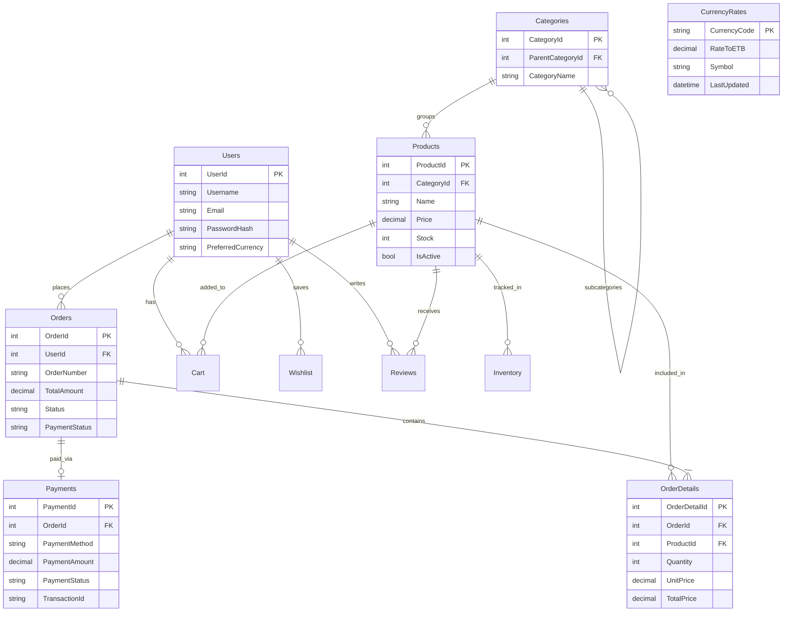
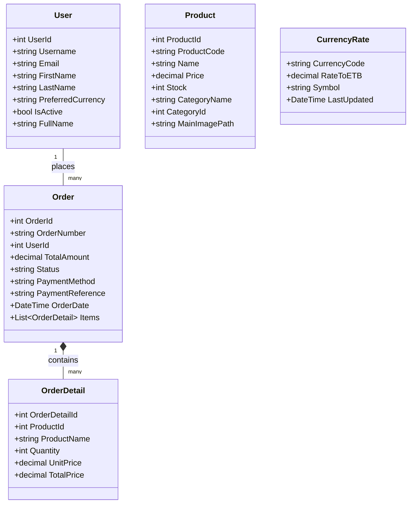
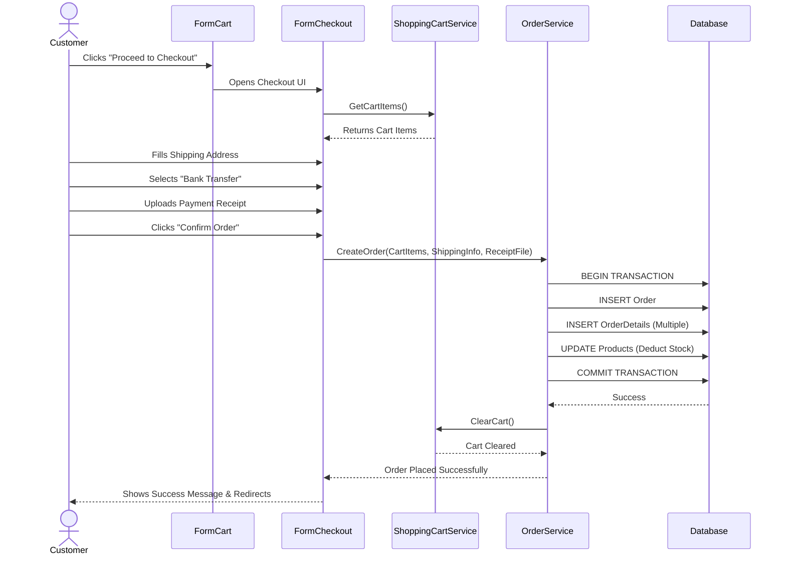
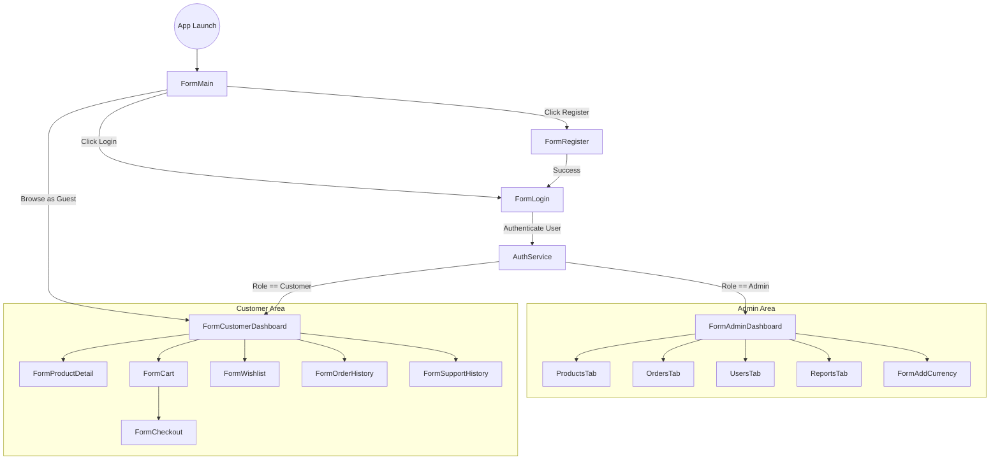
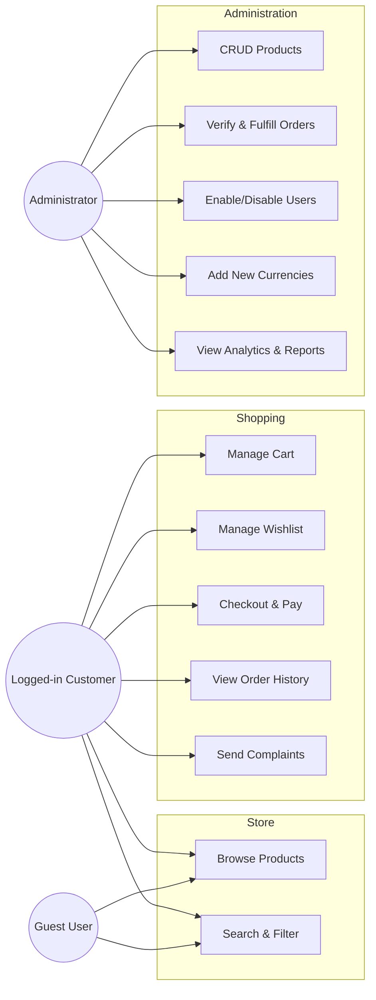

# E-Commerce Speed: System Architecture & Design Documentation

This document outlines the high-level architecture, data models, logic flows, and use cases of the **E-Commerce Speed** Management System. 

---

## 1. Entity-Relationship Diagram (ERD)
This diagram illustrates the core database schema and table relationships. The database is relational, centering around `Users`, `Products`, and `Orders`.

---

## 2. Class / Entity Diagram
This diagram highlights the primary Object-Oriented C# models that handle business logic before persisting data to the database.

---

## 3. Sequence Diagram: Checkout Flow
This sequence demonstrates the logic flow when a customer initiates the checkout process and successfully uploads payment evidence.

---

## 4. Flow Diagram: Navigation & Routing
This diagram visualizes how users transition between the main Windows Forms based on authentication and roles.

---

## 5. Use Case Diagram
This diagram outlines the distinct capabilities separated by the primary system actors (Guest, Customer, and Administrator).

